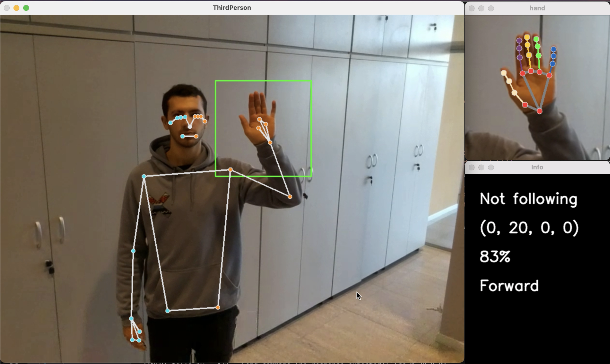

# ThirdPerson

This repository contains the code developed for the undergraduate thesis project developed between September and December 2023 for the Polytechnic University of Madrid.

ThirdPerson lets users control a drone by using gestures. It has 2 modes: not following and following. The latter tracks the user with the information provided by MediaPipe.

## Installation

To use ThirdPerson, you can either install it by using Docker or by running the following command:

`` pip3 install -r requirements.txt``

## Usage

Connect the Tello drone and execute `main.py`. If you do not have a drone, you can activate the simulation option in `config.json`, which will access your webcam.

With the app running, 3 windows should open, as seen in the picture below:

Point to the drone to change the following mode.

## Customization

ThirdPerson is designed to be highly customizable. Each module can be used independently to implement individual functions. To add gestures, run `model/add_gesture.py`. To retrain the neural network, run the cells in `model/keypoint_model_training.ipynb`.

## Other stuff

To read about the design behind this project, see [the thesis (in Spanish)](https://oa.upm.es/80489/)
